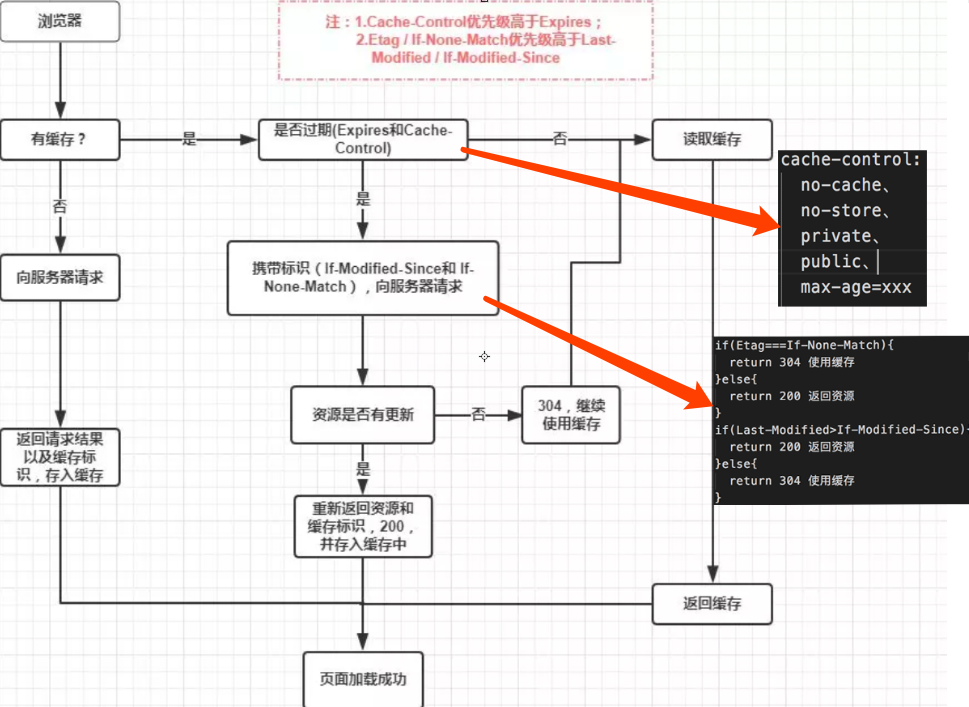
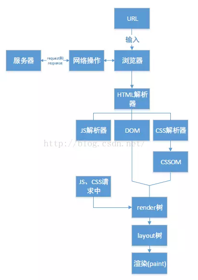

<h4>浏览器相关</h4>

&emsp;[1. 浏览器是由什么组成的](#l1)

&emsp;[2. 浏览器缓存机制](#l2)

&emsp;[3. 浏览器渲染机制](#l3)

&emsp;[4. 几个很实用的BOM属性对象方法](#l4)

  [5. 浏览器渲染的过程和原理](https://zhuanlan.zhihu.com/p/29418126)

  [6. 浏览器内核、JS 引擎、页面呈现原理及其优化](https://www.zybuluo.com/yangfch3/note/671516)  
  
  [7. 浏览器304缓存原理](https://my.oschina.net/ososchina/blog/494074)


### 浏览器相关

<h5 id='l1'>1. 浏览器是由什么组成的</h5>

> 从原理构成上分为七个模块，分别是 `User Interface（用户界面）`、 `Browser engine（浏览器引擎）` 、 `Rendering engine（渲染引擎）` 、 `Networking（网络）` 、 `JavaScript Interpreter（js解释器）` 、 `UI Backend（UI后端）` 、`Date Persistence（数据持久化存储）`


> 其中，最重要的是渲染引擎（内核）和 `JavaScript` 解释器（`JavaScript`引擎）

> 浏览器内核主要负责 `HTML` 、`CSS` 的解析，页面布局、渲染与复合层合成; `JavaScript` 引擎负责 `JavaScript` 代码的解释与执行

<h5 id='l2'>2. 浏览器缓存机制</h5>


> 浏览器的缓存机制也就是我们说的 `HTTP` 缓存机制，其机制是根据 `HTTP` 报文的缓存标识进行的

参考 [这里](https://juejin.im/entry/5ad86c16f265da505a77dca4)

<h5 id='l3'>3. 浏览器渲染机制</h5>



参考 [这里](https://juejin.im/entry/59e1d31f51882578c3411c77)
* [浏览器的渲染机制](https://www.jianshu.com/p/05eb1b17b298)

<h5 id='l4'>4. 几个很实用的BOM属性对象方法</h5>

> location 对象：主要存储 url 相关信息


> history 对象：浏览历史信息相关

```js
history.go() // 前进或后退指定的页面数 history.go(num);
history.back() // 后退一页
history.forward() // 前进一页
```
 
> navigator 对象：浏览器信息相关

```js
navigator.userAgent  //返回用户代理头的字符串表示(就是包括浏览器版本信息等的字符串)
navigator.cookieEnabled // 返回浏览器是否支持(启用)cookie
```
