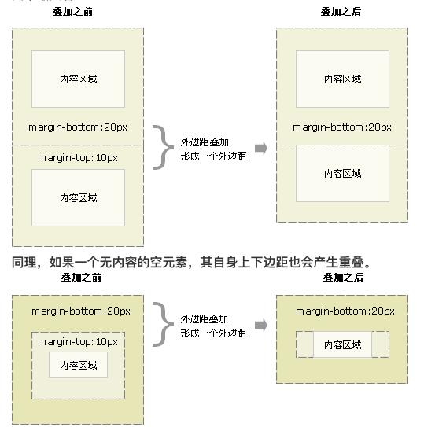

<html>
<h2>目录</h2>
</html>

[CSS 部分](#css)

&emsp;[1. css 盒子模型，box-sizing 属性的理解](#c1)

&emsp;[2. 清除浮动，什么时候需要清除浮动，清除浮动都有哪些方法](#c2)

&emsp;[3. 如何让一个不定宽高的盒子水平垂直居中](#c3)

&emsp;[4. px 和 em 和 rem 的区别](#c4)

&emsp;[5. position 的值有哪些](#c5)

&emsp;[6. display:none 与 visibility：hidden 的区别](#c6)

&emsp;[7. CSS 中 link 和@import 的区别](#c7)

&emsp;[8. 什么是响应式设计，响应式设计的基本原理是什么](#c8)

&emsp;[9. 为什么要初始化 CSS 样式](#c9)

&emsp;[10. CSS3 有哪些新特性](#c10)

&emsp;[11. ::before 和 :after 中双冒号和单冒号有什么区别？解释一下这 2 个伪元素的作用](#c11)

&emsp;[12. CSS 优化、提高性能的方法有哪些](#c12)

&emsp;[13. 重绘和回流，浏览器是怎样解析 CSS 的](#c13)

&emsp;[14. flex 布局 css 预处理器](#c14)

&emsp;[15. css 预处理器](#c15)

&emsp;[16. css 外边距(margin)重叠及防止](#c16)

&emsp;[17. css 选择器及优先顺序](#c17)

&emsp;[18. css 浏览器兼容性问题和布局问题](#c18)

&emsp;[19. 移动端适配 1px 的问题](#c19)

&emsp;[20. 画一条 0.5px 的直线](#c20)

<h3 id='start'>前言</h3>

每年都会出去面试一圈，积累更多的经验、拓展自己的知识面，整体的感觉是大多数都比较注重基础性的东西，那就从最基本的写起吧 ↓

### CSS

<h5 id='c1'>1. css盒子模型，box-sizing属性的理解</h5>

css 的盒模型由 content(内容)、padding(内边距)、border(边框)、margin(外边距)组成。但盒子的大小由 content+padding+border 这几部分决定

box-sizing 是一个 CSS3 属性，与盒子模型有着密切联系。即决定元素的宽高如何计算，box-sizing 有三个属性：

```css
box-sizing: content-box|border-box|inherit:
```

- content-box 使得元素的宽高即为内容区的宽高(默认模式)
- border-box: 计算方式 content + padding + border = 本身元素大小，即缩小了 content 大小
- inherit 指定 box-sizing 属性的值，应该从父元素继承

CSS 的两种盒模型：

1、在 W3C 标准的盒子模型中,width 指 content 部分的宽度
2、在 IE 盒子模型中,width 表示 content+padding+border 这三个部分的宽度

<h5 id='c2'>2. 清除浮动，什么时候需要清除浮动，清除浮动都有哪些方法</h5>

浮动的元素是脱离文档标准流的，如果我们不清楚浮动，那么就会造成**父元素高度塌陷**，影响页面布局。

清除浮动的方式：

- 为父元素设置高度
- 为父元素添加`overflow:hidden`
- 伪元素

```css
.fix::after {
  content: "";
  display: block;
  clear: both;
}
```

使用伪元素的好处：不增加冗余的 DOM 节点，符合语义化

> overflow:hidden 可以触发 BFC 机制。BFC：块级格式化上下文，创建了 BFC 的元素就是一个独立的盒子，它规定了内部如何布局，并且与这个独立盒子里的布局不受外部影响，当然它也不会影响到外面的元素，**计算 BFC 的高度时，浮动元素也参与计算**

<h5 id='c3'>3. 如何让一个不定宽高的盒子水平垂直居中</h5>

> 定位的方式

```css
.father {
  position: relative;
}
.son {
  position: absolute;
  top: 0;
  right: 0;
  bottom: 0;
  left: 0;
  margin: auto;
}
```

> css3 属性

```css
.father {
  position: relative;
}
.son {
  position: absolute;
  top: 50%;
  left: 50%;
  transform: translate(-50%, -50%);
}
```

> flex 布局

```css
.father {
  display: flex;
  justify-content: center;
  align-items: center;
}
```

<h5 id='c4'>4. px和em和rem的区别</h5>

> `px`: 像素，相对长度单位。像素`px`是相对于显示器屏幕分辨率而言的

> `em`的值并不是固定的，会继承父级元素的字体大小，代表倍数

> `rem`的值并不是固定的，始终是基于根元素 `<html>` 的，也代表倍数

<h5 id='c4-1'>4-1. 移动端高清方案如何解决 ? rem适配方案</h5>

<meta name="viewport" 
content="width=device-width,initial-scale=1.0,maximum-scale=1.0,user-scalable=no"/>

<body style="margin:0;padding:0;font-size:0.32rem"></body>

> width=device-width:表示宽度是设备屏幕的宽度
> initial-scale=1.0:表示初始的缩放比例
> minimum-scale=1.0:表示最小的缩放比例
> maximum-scale=1.0:表示最大的缩放比例
> user-scalable=no: 表示用户是否可以调整缩放比例

##### 原理：

1、根据设备屏幕的设备像素比动态设置 html 的 font-size,(设备像素比，又称 DPPX,比如 dpr=2 时,表示 1 个 css 像素由 4 个物理像素点组成)

2、自动设置 meta 标签 viewport

https://www.cnblogs.com/Vayne-N/p/6913204.html附阿里提供的原生JS压缩的高清方案布局代码

<h5 id='c5'>5. position的值有哪些</h5>

> static： 默认值。没有定位，元素出现在正常的流中

> relative（相对定位）：生成相对定位的元素,相对于其正常（原先本身）位置进行定位

> absolute（绝对定位）：生成绝对定位的元素，相对于 static 定位以外的第一个父元素进行定位

> fixed（固定定位）：生成绝对定位的元素，相对于浏览器窗口进行定位

<h5 id='c6'>6. display:none与visibility：hidden的区别</h5>

| 区别           | display:none                                                                 | visibility：hidden 的                                                           |
| -------------- | ---------------------------------------------------------------------------- | ------------------------------------------------------------------------------- |
| 是否占据空间   | 不占据任何空间，在文档渲染时，该元素如同不存在（但依然存在文档对象模型树中） | 该元素空间依旧存在                                                              |
| 是否渲染       | 会触发 reflow（回流），进行渲染                                              | 只会触发 repaint（重绘），因为没有发现位置变化，不进行渲染                      |
| 是否是继承属性 | 不是继承属性，元素及其子元素都会消失                                         | 是继承属性，若子元素使用了 visibility:visible，则不继承，这个子孙元素又会显现出 |

<h5 id='c7'>7. CSS中link 和@import的区别</h5>

> link 属于 XHTML 标签，@import 完全是 CSS 提供的一种方式,只能加载 CSS

> 加载顺序的差别，当一个页面被加载的时候，link 引用的 CSS 会同时被加载，而@import 引用的 CSS 会等到页面全部被下载完再被加载

> 兼容性的差别。由于@import 是 CSS2.1 提出的所以老的浏览器不支持，而 link 标签无此问题

> 当使用 javascript 控制 dom 去改变样式的时候，只能使用 link 标签，因为@import 不是 dom 可以控制的

<h5 id='c8'>8. 什么是响应式设计，响应式设计的基本原理是什么</h5>

> 响应式网站设计是一个网站能够兼容多个终端，而不是为每一个终端做一个特定的版本。基本原理是通过媒体查询检测不同的设备屏幕尺寸做处理

<h5 id='c9'>9. 为什么要初始化CSS样式</h5>

> 因为浏览器的兼容问题，不同浏览器对有些标签的默认值是不同的，如果没对 CSS 初始化往往会出现浏览器之间的页面显示差异

> 初始化样式会对 SEO 有一定的影响

<h5 id='c10'>10. CSS3有哪些新特性</h5>

- 实现圆角`border-radius`，阴影`box-shadow`，边框图片`border-image`
- 对文字加特效`text-shadow`，强制文本换行`word-wrap`，线性渐变`linear-gradient`
- 实现旋转`transform:rotate(90deg)`,缩放`scale(0.85,0.90)`,`translate(0px,-30px)`定位,倾斜`skew(-9deg,0deg)`;
- 增加了更多的 CSS 选择器、多背景、`rgba()`
- 唯一引入的伪元素是`::selection`；
- 实现媒体查询`@media`，多栏布局`flex`
- 过渡`transition` 动画`animation`

<h5 id='c11'>11. ::before 和 :after中双冒号和单冒号有什么区别？解释一下这2个伪元素的作用</h5>

> 单冒号(:)用于 CSS3 伪类，双冒号(::)用于 CSS3 伪元素。（伪元素由双冒号和伪元素名称组成）,双冒号是在当前规范中引入的，用于区分伪类和伪元素

<h5 id='c12'>12. CSS优化、提高性能的方法有哪些</h5>

- 移除空的 css 规则（Remove empty rules）
- 正确使用 display 的属性
- 不滥用浮动、web 字体
- 不声明过多的 font-size
- 不在选择符中使用 ID 标识符
- 遵守盒模型规则
- 尽量减少页面重排、重绘
- 抽象提取公共样式，减少代码量

<h5 id='c13'>13. 重绘和回流</h5>
重绘：当页面中元素样式的改变并不影响它在文档的位置(如：color、background-color、visibility等)，浏览器会将新样式赋予给元素并重新绘制它，这个过程称为重绘

回流：当 Render Tree 中部分或全部元素的尺寸、结构、或某些属性发生改变时，浏览器重新渲染部分或全部文档的过程称为回流，常用引起回流的操作有：scrollTo()、scrollTop()、getComputedStyle()

回流必将引起重绘，重绘不一定引起回流

[重绘和回流](https://juejin.im/post/5a9923e9518825558251c96a)

<h5 id='c14'>14. flex布局</h5>

[flex 布局教程--阮一峰](http://www.ruanyifeng.com/blog/2015/07/flex-grammar.html)

<h5 id='c15'>15. css预处理器</h5>

提供了一种 css 的书写方式，常见的就是 [SAAS 文档](http://sass.bootcss.com/docs/sass-reference/) 和 [LESS 文档](https://less.bootcss.com/)

<h5 id='c16'>16. css外边距(margin)重叠及防止</h5>

现象是：外边距重叠是指两个垂直相邻的块级元素，当上下两个边距相遇时，起外边距会产生重叠现象，且重叠后的外边距，等于其中较大者。


解决方案：

1、外层元素 padding 代替

2、内层元素透明边框 border:1px solid transparent;

3、内层元素绝对定位 postion:absolute:

4、外层元素 overflow:hidden;

5、内层元素 加 float:left;或 display:inline-block;

6、内层元素 padding:1px;

<h5 id='c17'>17. css选择器及优先级排序</h5>

1、！important

2、行内样式，在 style 属性里面写的样式

3、id 选择器

4、class 选择器

5、标签选择器

6、通配符选择器

7、浏览器的自定义属性和继承

<h5 id='c18'>18. css浏览器兼容性问题和布局问题</h5>

<h5 id='c19'>19. 移动端适配1px的问题</h5>

###### 原因：

1、在 window 对象中有一个 devicePixelRatio 属性，可以反映 css 中的像素与设备的像素比。

2、<font color="red">不同的移动设备有不同的像素密度。</font>

3、devicePixelRatio=物理像素/独立像素 1px 变粗的原因：viewport 的设置物理像素和 css 像素的比例，在 retina 屏的苹果手机上，这个值为 2 或 3，css 里写的 1px 长度映射到物理像素上就有 2px 或 3px 那么长

###### 解决：flexible.js 布局(手淘团队)

1、rem 布局和字体的处理

- rem 布局中字体不是用 rem 而使用 px（计算时会有偏差）
- 为了更好的阅读体验，更好的做法是利用 px 和媒体查询来进行适配，对 font-size 进行放大的处理

```js
   @mixin font-dpr($font-size){
     font-size:$font-size;
     [data-dpr="2"]&{
       font-size:$font-size*2;
     }
     [data-dpr="3"]&{
       font-size:$font-size*3;
     }
   }
```

2、Retina 屏幕下的处理与安卓手机的适配

- flexible 布局仅仅只是针对 iPhone 进行适配，而默认所有的安卓设备都强制性设置 dpr 为 1（因为苹果 Retina 屏幕、安卓非 Retina 屏幕）

###### 阻止用户缩放方法

```js
  <meta name="viewport" content="width=device-width,initial-scale=1.0,maximum-scale=1.0,user-scalable=no;" >
```

移动端手机上尽管这样设置了，用户还是可以通过手势来缩放，解决方案如下：

```js
// 检测touch相关事件来阻止事件的触发即可
window.onload = function () {
  // 同时按下两个手指
  document.addEventListener("touchstart", function (event) {
    if (event.touches.length > 1) {
      event.preventDefault();
    }
  });
  var lastTouchEnd = 0;
  //特别注意300ms时差的设置
  document.addEventListener("touchend", function (event) {
    var now = new Date().getTime();
    if (now - lastTouchEnd <= 300) {
      event.preventDefault();
    }
    lastTouchEnd = now;
  });
};
```

<h5 id='c20'>20. 画一条0.5px的直线？</h5>

```javascript
  height:1px;
  transform:scale(0.5);

```
