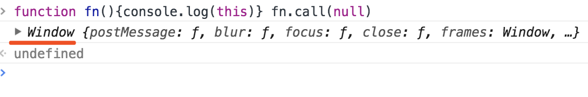
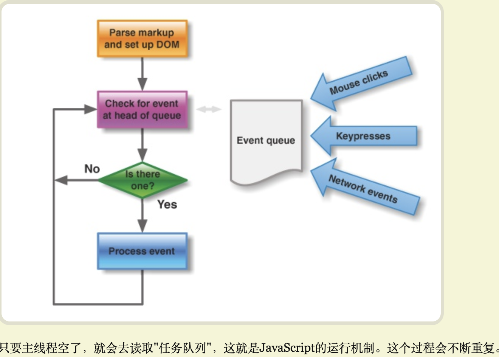
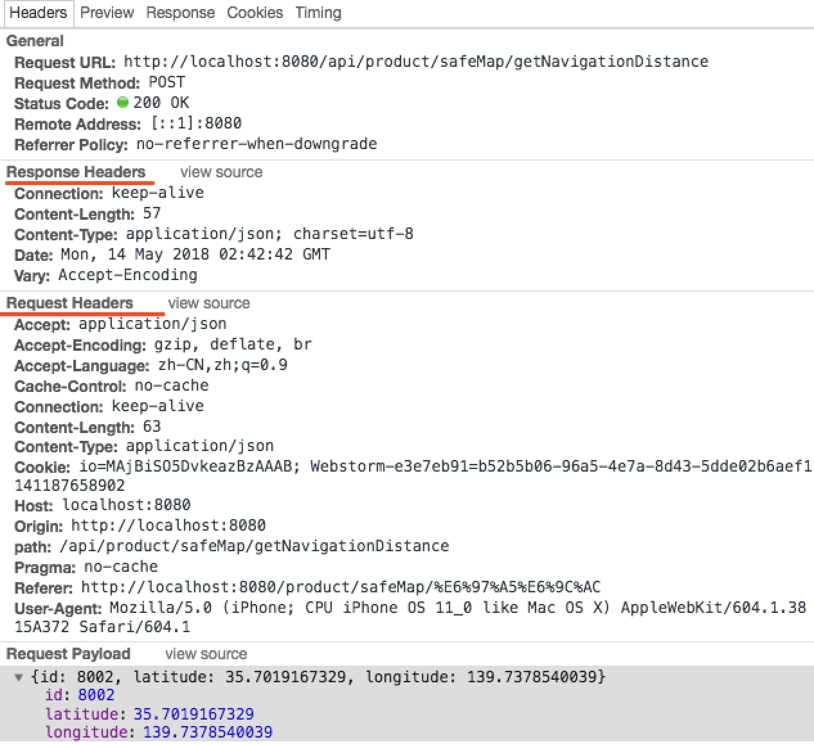
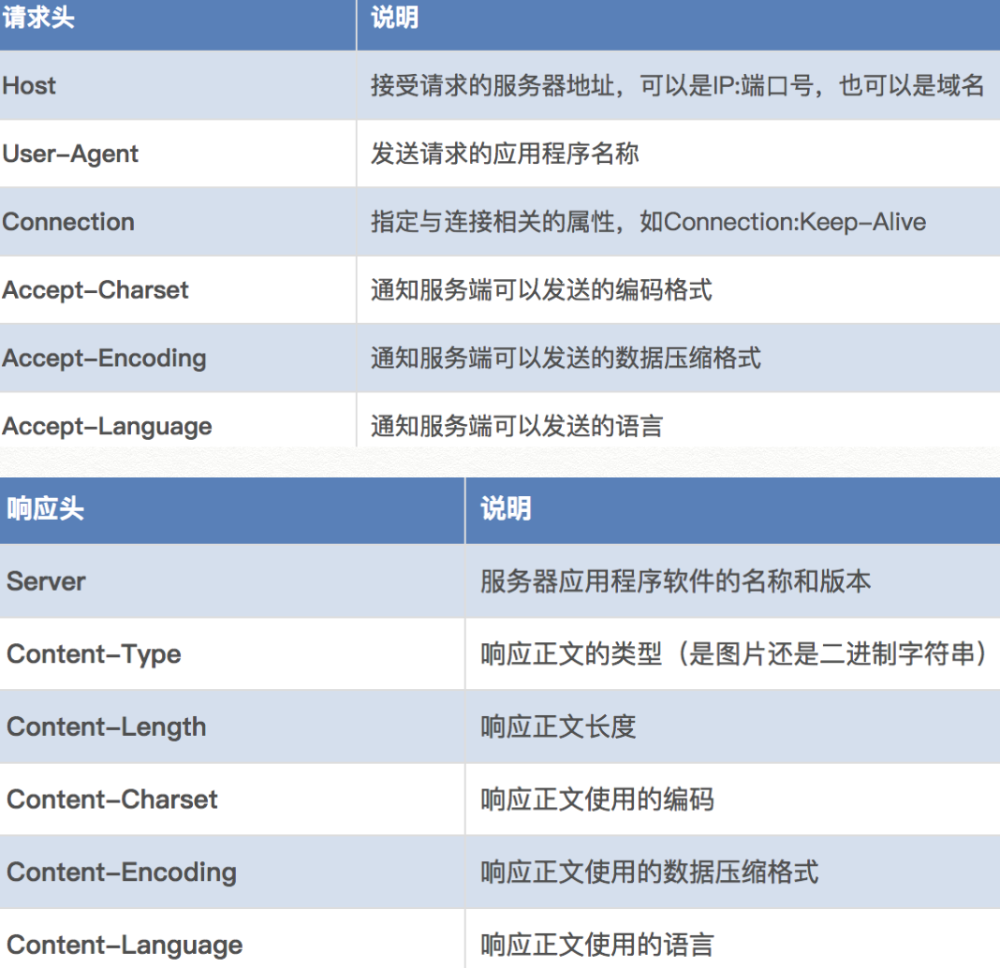

<html>
<h2>目录</h2>
</html>

&emsp;[1. JavaScript 有哪些数据类型](#j1)

&emsp;[2. 怎么判断不同的JS数据类型](#j2)

&emsp;[3. undefined 和 null 有什么区别](#j3)

&emsp;[4. 数组对象有哪些常用方法](#j4)

&emsp;[5. Js 有哪几种创建对象的方式](#j5)

&emsp;[6. 怎么实现对对象的拷贝(浅拷贝与深拷贝)](#j6)

&emsp;[7. 什么是闭包，为什么要用它](#j7)

&emsp;[8. 介绍一下 JavaScript 原型，原型链，它们有何特点](#j8)

&emsp;[9. JavaScript 如何实现继承](#j9)

&emsp;[10. new 操作符具体干了什么](#j10)

&emsp;[11. 同步和异步的区别，怎么异步加载 JavaScript](#j11)

&emsp;[12. 跨域问题的产生，怎么解决它](#j12)

&emsp;[13. 对 this 的理解](#j13)

&emsp;[14. apply()、call()和 bind() 是做什么的，它们有什么区别](#j14)

&emsp;[15. 什么是内存泄漏，哪些操作会造成内存泄漏](#j15)

&emsp;[16. 什么是事件代理，它的原理是什么](#j16)

&emsp;[17. 对AMD和CMD的理解，它们有什么区别](#j17)

&emsp;[18. 对ES6的了解](#j18)

&emsp;[19. 箭头函数有什么特点](#j19)

&emsp;[19.1 箭头函数和普通函数的区别](#j19.1)

&emsp;[20. Promise 对象的了解](#j20)

&emsp;[21. async 函数以及 awit 命令](#j21)

&emsp;[22. export 与 export default有什么区别](#j22)

&emsp;[23. 前端性能优化](#j23)

&emsp;[24. 对JS引擎执行机制的理解](#j24)

&emsp;[25. webSocket如何兼容低浏览器？websocket长连接原理是什么?](#j25)

&emsp;[26. web开发中会话跟踪的方法有哪些?](#j26)

&emsp;[27. caller 和callee 的作用？](#j27)

&emsp;[28. call和apply作用和区别。传null有没有影响,Function.call(null)  ，Function.apply(null)？](#j28)

&emsp;[29. 单线程原理的过程？](#j29)

&emsp;[30. 观察者模式实现？](#j30)

&emsp;[31. HTTP报文头部有哪些字段? 有什么意义？](#j31)

&emsp;[32. 从输入URL到页面加载发生了什么？](#j32)

&emsp;[33、TCP三次握手的过程（SSL/TLS协议运行机制的概述）？](#j33)

&emsp;[34、上拉刷新和下拉加载的实现逻辑 ？](#j34)

&emsp;[35、客户端渲染和服务端渲染的区别 ？](#j35)

&emsp;[36、浏览器事件有哪些过程? 为什么一般在冒泡阶段, 而不是在捕获阶段注册监听? addEventListener 参数分别是什么 ？](#j36)

&emsp;[37、移动端300ms延时的原因? 如何处理?](#j37)

&emsp;[38、JSBridge原理, js和native是如何通信的?](#j38)

&emsp;[39、实现简易模板函数?](#j39)

&emsp;[40、es5实现const?](#j40)

&emsp;[41、编程实现new操作符?](#j41)

&emsp;[42、ES5实现Promise.all?](#j42)

&emsp;[43、实现const对象内部的key值不可修改?](#j43)

&emsp;[44、手写一个Bind函数?](#j44)

&emsp;[45、JS实现页面滚动至图片处加载?](#j45)

&emsp;[46、webpack如何配置ES6语法IE兼容性处理?](#j46)

&emsp;[47、forEach与map的区别?](#j47)

&emsp;[48、数组多类型去重?](#j48)

&emsp;[49、Async/Await 如何通过同步的方式实现异步?](#j49)

&emsp;[50、简单讲解一下 http2 的多路复用?](#j50)

&emsp;[51、Promise为什么比setTimeout先执行?](#j51)

&emsp;[52、JS异步解决方案的发展历程以及优缺点?](#j52)

&emsp;[53、是否改变原数组的常用方法?](#j53)

&emsp;[54、object.defineProperty与proxy的区别?](#j54)

<h5 id='j1'>1. JavaScript 有哪些数据类型</h5>

6种原始数据类型：
- Boolean: 布尔表示一个逻辑实体，可以有两个值：`true` 和 `false`
- Number: 用于表示数字类型
- String: 用于表示文本数据
- Null: `Null` 类型只有一个值： `null`,特指对象的值未设置
- Undefined: 一个没有被赋值的变量会有个默认值 `undefined`
- Symbol: 符号(Symbols)是ECMAScript第6版新定义的。符号类型是唯一的并且是不可修改的

引用类型：`Object`

详见 [JavaScript的数据类型-MDN](https://developer.mozilla.org/zh-CN/docs/Web/JavaScript/Data_structures)

<h5 id='j2'>2. 怎么判断不同的JS数据类型 </h5>

- `typeof`操作符：返回一个字符串，表示未经计算的操作数的类型

> `typeof` 操作符对于简单数据类型，返回其本身的数据类型，函数对象返回 `function` ，其他对象均返回 `Object`

> `null` 返回 `Object`
- instanceof的作用：1、用于判断一个引用类型是否属于某构造函数； 2、 还可以在继承关系中用来判断一个实例是否属于它的父类型

- instanceof: 用来判断A 是否是 B的实例，表达式为 `A instanceof B`，返回一个`Boolean`类型的值

- 和typeof的区别：typeof在对值类型number、string、boolean、null、undefined、以及引用类型的function的反应是精准的；但是，对于对象{}、数组[]、null都会返回object

为了弥补这一点，instanceof从原型的角度，来判断某引用属于哪个构造函数，从而判定它的数据类型

- instanceof 实现原理：通过原型链来实现继承关系的判断
```javascript
   function instance_of(L,R){
     let o=R.prototype;//取R的显示原型
     L = L.__proto__; //取L的隐式原型
     while(true){     //循环执行，直到o严格等于L
       if(L===null) return false;
       if(o===L)return true
       L=L.__proto__;
     }  
   }
   //instance_of函数即是instanceof操作符的代码实现，并需要注意传入的参数都是为object类型
```
> `instanceof` **检测的是原型,只能用来判断两个对象是否属于实例关系， 而不能判断一个对象实例具体属于哪种类型**

```js
let a = [];
a instanceof Array  // true
a instanceof Object // true
```
> 变量a 的 `__proto__`  直接指向`Array.prototype`，间接指向 `Object.prototype`，所以按照 `instanceof` 的判断规则，a 就是`Object`的实例.针对数组的这个问题，ES5 提供了 `Array.isArray()` 方法 。该方法用以确认某个对象本身是否为 Array 类型

- constructor: 当一个函数被定义时，JS引擎会为其添加`prototype`原型，然后再在 `prototype`上添加一个 `constructor` 属性，并让其指向该函数的引用

> `null`和`undefined`是无效的对象，因此是不会有`constructor`存在的，这两种类型的数据需要通过其他方式来判断

> 函数的`constructor`是不稳定的，这个主要体现在自定义对象上，当开发者重写`prototype`后，原有的`constructor`引用会丢失，`constructor`会默认为 `Object`

```js
function F() {};
var f = new F;
f.constructor == F // true

F.prototype = {a: 1}
var f = new F
f.constructor == F // false 
```
> 在构造函数 `F.prototype` 没有被重写之前，构造函数 `F` 就是新创建的对象 `f` 的数据类型。当 `F.prototype` 被重写之后，原有的 `constructor` 引用丢失, 默认为 Object

> 因此，为了规范开发，在重写对象原型时一般都需要重新给 `constructor` 赋值，以保证对象实例的类型不被篡改

- toString: `Object` 的原型方法，调用该方法，默认返回当前对象的 `[[Class]]` 。这是一个内部属性，其格式为 `[object Xxx]` ，其中 `Xxx` 就是对象的类型

```js
Object.prototype.toString.call('') ;   // [object String]
Object.prototype.toString.call(11) ;    // [object Number]
Object.prototype.toString.call(true) ; // [object Boolean]
Object.prototype.toString.call(Symbol()); //[object Symbol]
Object.prototype.toString.call(undefined) ; // [object Undefined]
Object.prototype.toString.call(null) ; // [object Null]
Object.prototype.toString.call(new Function()) ; // [object Function]
Object.prototype.toString.call([]) ; // [object Array]
```

<h5 id='j3'>3. undefined 和 null 有什么区别</h5>

> `null`表示"没有对象"，即该处不应该有值

典型用法：

1. 作为函数的参数，表示该函数的参数不是对象
2. 作为对象原型链的终点

> `undefined`表示"缺少值"，就是此处应该有一个值，但是还没有定义

典型用法：

1. 变量被声明了，但没有赋值时，就等于`undefined`
2. 调用函数时，应该提供的参数没有提供，该参数等于`undefined`
3. 对象没有赋值的属性，该属性的值为`undefined`
4. 函数没有返回值时，默认返回`undefined`

详见： [undefined和null的区别-阮一峰](http://www.ruanyifeng.com/blog/2014/03/undefined-vs-null.html)

<h5 id='j4'>4. 数组对象有哪些常用方法</h5>

> 修改器方法：

- pop(): 删除数组的最后一个元素，并返回这个元素
- push()：在数组的末尾增加一个或多个元素，并返回数组的新长度
- reverse(): 颠倒数组中元素的排列顺序
- shift(): 删除数组的第一个元素，并返回这个元素
- unshift(): 在数组的开头增加一个或多个元素，并返回数组的新长度
- sort(): 对数组元素进行排序，并返回当前数组
- splice(): 在任意的位置给数组添加或删除任意个元素

> 访问方法：

- concat(): 返回一个由当前数组和其它若干个数组或者若干个非数组值组合而成的新数组
- join(): 连接所有数组元素组成一个字符串
- slice(): 抽取当前数组中的一段元素组合成一个新数组
- indeOf(): 返回数组中第一个与指定值相等的元素的索引，如果找不到这样的元素，则返回 -1
- lastIndexOf(): 返回数组中最后一个（从右边数第一个）与指定值相等的元素的索引，如果找不到这样的元素，则返回 -1

> 迭代方法：

- forEach(): 为数组中的每个元素执行一次回调函数,最终返回 `undefined`
- every(): 如果数组中的每个元素都满足测试函数，则返回 `true`，否则返回 false
- some(): 如果数组中至少有一个元素满足测试函数，则返回 `true`，否则返回 false
- filter(): 将所有在过滤函数中返回 `true` 的数组元素放进一个新数组中并返回
- map(): 返回一个由回调函数的返回值组成的新数组

更多方法请参考 MDN [传送门](https://developer.mozilla.org/zh-CN/docs/Web/JavaScript/Reference/Global_Objects/Array)


<h5 id='j5'>5. Js 有哪几种创建对象的方式</h5>

> 对象字面量
```js
var obj = {}
```
> Object 构造函数
```js
var obj = new Object()
```

> 工厂模式
```js
function Person(name, age) {
    var o = new Object()
    o.name = name;
    o.age = age;
    o.say = function() {
        console.log(name)
    }
    return o
}
```
缺点： 每次通过`Person`创建对象的时候，所有的`say`方法都是一样的，但是却存储了多次，浪费资源

> 构造函数模式
```js
function Person(name, age) {
    this.name = name
    this.age = age
    this.say = function() {
        console.log(name)
    }
}
var person = new Person('hello', 18)
```
构造函数模式隐试的在最后返回`return this` 所以在缺少`new`的情况下，会将属性和方法添加给全局对象，浏览器端就会添加给`window`对象,可以根据`return this` 的特性调用`call`或者`apply`指定`this`

> 原型模式
```js
function Person() {}
Person.prototype.name = 'hanmeimei';
Person.prototype.say = function() {
  alert(this.name);
}
Person.prototype.friends = ['lilei'];
var person = new Person();
```
实现了方法与属性的共享，可以动态添加对象的属性和方法。但是没有办法创建实例自己的属性和方法，也没有办法传递参数

> 构造函数和原型组合
```js
function Person(name, age) {
    this.name = name
    this.age = age
}
Person.prototype.say = function() {
    console.log(this.name)
}
var person = new Person('hello')
```

还有好几种模式，感兴趣的小伙伴可以参考 **红宝书**，你们肯定知道的了！

<h5 id='j6'>6. 怎么实现对对象的拷贝(浅拷贝与深拷贝)</h5>

> 浅拷贝

- 拷贝原对象引用
- 可以使用`Array.prototype.slice()`也可以完成对一个数组或者对象的浅拷贝
- `Object.assign()`方法

> 深拷贝

- 最常用的方式就是 `JSON.parse(JSON.stringify(目标对象)`，缺点就是只能拷贝符合`JSON`数据标准类型的对象

<h5 id='j7'>7. 什么是闭包，为什么要用它</h5>

> 简单来说，闭包就是能够读取其他函数内部变量的函数
```js
function Person() {
    var name = 'hello'
    function say () {
        console.log(name)
    }
    return say()
}
Person() // hello
```
> 由于 JavaScript 特殊的作用域，函数外部无法直接读取内部的变量，内部可以直接读取外部的变量，从而就产生了闭包的概念

用途：
> 最大用处有两个，一个是前面提到的可以读取函数内部的变量，另一个就是让这些变量的值始终保持在内存中

注意点：
> 由于闭包会使得函数中的变量都被保存在内存中，内存消耗很大，所以不能滥用闭包，否则会造成网页的性能问题，在IE中可能导致内存泄露

<h5 id='j8'>8. 介绍一下 JavaScript 原型，原型链，它们有何特点</h5>

首先明确一点，**JavaScript是基于原型的**

> 每个构造函数(constructor)都有一个原型对象(prototype),原型对象都包含一个指向构造函数的指针,而实例(instance)都包含一个指向原型对象的内部指针.


图解：
- 每一个构造函数都拥有一个`prototype`属性，这个属性指向一个对象，也就是原型对象
- 原型对象默认拥有一个`constructor`属性，指向指向它的那个构造函数
- 每个对象都拥有一个隐藏的属性`[[prototype]]`，指向它的原型对象

那么什么是原型链：

> `JavaScript`中所有的对象都是由它的原型对象继承而来。而原型对象自身也是一个对象，它也有自己的原型对象，这样层层上溯，就形成了一个类似链表的结构，这就是原型链

> 所有原型链的终点都是`Object`函数的`prototype`属性。`Objec.prototype`指向的原型对象同样拥有原型，不过它的原型是`null`，而`null`则没有原型


<h5 id='j9'>9. JavaScript 如何实现继承</h5>

- 原型链继承

```js
function Animal() {}
Animal.prototype.name = 'cat'
Animal.prototype.age = 1
Animal.prototype.say = function() {console.log('hello')}

var cat = new Animal()

cat.name  // cat
cat.age  // 1
cat.say() // hello
```
> 最简单的继承实现方式，但是也有其缺点
1. 来自原型对象的所有属性被所有实例共享
2. 创建子类实例时，无法向父类构造函数传参
3. 要想为子类新增属性和方法，必须要在`new`语句之后执行，不能放到构造器中

- 构造继承

```js
function Animal() {
    this.species = "动物"
}
function Cat(name, age) {
    Animal.call(this)
    this.name = name 
    this.age = age
}

var cat = new Cat('豆豆', 2)

cat.name  // 豆豆
cat.age // 2
cat.species // 动物
```
> 使用call或apply方法，将父对象的构造函数绑定在子对象上.

- 组合继承

```js
function Animal() {
    this.species = "动物"
}

function Cat(name){
  Animal.call(this)
  this.name = name
}

Cat.prototype = new Animal() // 重写原型
Cat.prototype.constructor = Cat

```
> 如果没有`Cat.prototype = new Animal()`这一行，`Cat.prototype.constructor`是指向`Cat`的；加了这一行以后，`Cat.prototype.constructor`指向`Animal`.这显然会导致继承链的紊乱（cat1明明是用构造函数Cat生成的），因此我们必须手动纠正，将`Cat.prototype`对象的`constructor`值改为`Cat`

- `extends` 继承
ES6新增继承方式，Class 可以通过extends关键字实现继承

```js
class Animal {
    
}

class Cat extends Animal {
    constructor() {
        super();
  }
}
```

> 使用 `extends` 实现继承，必须添加 `super` 关键字定义子类的 `constructor`，这里的`super()` 就相当于 `Animal.prototype.constructor.call(this)`

当然，还有很多种实现继承的方式，这里就不多说了。然后，再推荐一波 **红宝书**

<h5 id='j10'>10. new 操作符具体干了什么</h5>

- 创建一个空对象，并且 this 变量引用该对象，同时还继承了该函数的原型
- 属性和方法被加入到 this 引用的对象中
- 新创建的对象由 this 所引用，并且最后隐式的返回 this

<h5 id='j11'>11. 同步和异步的区别，怎么异步加载 JavaScript</h5>

> 同步模式

同步模式，又称阻塞模式。`javascript` 在默认情况下是会阻塞加载的。当前面的 `javascript` 请求没有处理和执行完时，会阻止浏览器的后续处理

> 异步模式

异步加载又叫非阻塞，浏览器在下载执行 `js` 同时，还会继续进行后续页面的处理

> 异步加载 JavaScript

- 动态添加 `script` 标签
- `defer`
- `async`

> `defer`属性和`async`都是属于 `script` 标签上面的属性，两者都能实现 `JavaScript` 的异步加载。不同之处在于：`async` 在异步加载完成的时候就马上开始执行了，`defer` 会等到 `html` 加载完毕之后再执行

<h5 id='j12'>12. 跨域问题的产生，怎么解决它</h5>

> 由于浏览器的 [同源策略](http://www.ruanyifeng.com/blog/2016/04/same-origin-policy.html)，在出现 域名、端口、协议有一种不一致时，就会出现跨域，属于浏览器的一种安全限制。

解决跨域问题有很多种方式，常用的就是以下几种：

- `jsonp` 跨域：动态创建`script`，再请求一个带参网址实现跨域通信.缺点就是只能实现 `get` 一种请求
- `document.domain + iframe`跨域：两个页面都通过js强制设置`document.domain`为基础主域，就实现了同域.但是仅限主域相同，子域不同的跨域应用场景
- 跨域资源共享（CORS）：只服务端设置`Access-Control-Allow-Origin`即可，前端无须设置，若要带`cookie`请求：前后端都需要设置
- `nginx`反向代理接口跨域：同源策略是浏览器的安全策略，不是`HTTP`协议的一部分。服务器端调用`HTTP`接口只是使用`HTTP`协议，不会执行JS脚本，不需要同源策略，也就不存在跨越问题
- `WebSocket`协议跨域

<h5 id='j13'>13. 对 this 的理解</h5>

在 `JavaScript` 中，研究 `this` 一般都是 `this` 的指向问题，核心就是 **`this` 永远指向最终调用它的那个对象**，除非改变 `this` 指向或者箭头函数那种特殊情况

```js
function test() {
    console.log(this);
}

test() // window

var obj = {
  foo: function () { console.log(this.bar) },
  bar: 1
};

var foo = obj.foo;
var bar = 2;

obj.foo() // 1
foo() // 2

// 函数调用的环境不同，所得到的结果也是不一样的
```

<h5 id='j14'>14. apply()、call()和 bind() 是做什么的，它们有什么区别</h5>

相同点：三者都可以**改变 this 的指向**

不同点： 

- apply 方法传入两个参数：一个是作为函数上下文的对象，另外一个是作为函数参数所组成的数组

```js

var obj = {
    name : 'sss'
}

function func(firstName, lastName){
    console.log(firstName + ' ' + this.name + ' ' + lastName);
}

func.apply(obj, ['A', 'B']);    // A sss B

```
- `call` 方法第一个参数也是作为函数上下文的对象，但是后面传入的是一个参数列表，而不是单个数组

```js
var obj = {
    name: 'sss'
}

function func(firstName, lastName) {
    console.log(firstName + ' ' + this.name + ' ' + lastName);
}

func.call(obj, 'C', 'D');       // C sss D
```

- `bind` 接受的参数有两部分，第一个参数是是作为函数上下文的对象，第二部分参数是个列表，可以接受多个参数

```js
var obj = {
    name: 'sss'
}

function func() {
    console.log(this.name);
}

var func1 = func.bind(null, 'xixi');
func1();
```

> `apply`、`call` 方法都会使函数立即执行，因此它们也可以用来调用函数

> `bind` 方法不会立即执行，而是返回一个改变了上下文 `this` 后的函数。而原函数 `func` 中的 `this` 并没有被改变，依旧指向全局对象 `window`

> `bind` 在传递参数的时候会将自己带过去的参数排在原函数参数之前

```js
function func(a, b, c) {
    console.log(a, b, c);
}
var func1 = func.bind(this, 'xixi');
func1(1,2) // xixi 1 2
```

<h5 id='j15'>15. 什么是内存泄漏，哪些操作会造成内存泄漏</h5>

> 内存泄漏：是指一块被分配的内存既不能使用，又不能回收，直到浏览器进程结束

可能造成内存泄漏的操作：
- 意外的全局变量
- 闭包
- 循环引用
- 被遗忘的定时器或者回调函数

你可能还需要知道 [垃圾回收机制](http://www.ruanyifeng.com/blog/2017/04/memory-leak.html) 此外，高程上面对垃圾回收机制的介绍也很全面，有兴趣的小伙伴可以看看

<h5 id='j16'>16. 什么是事件代理，它的原理是什么</h5>

> 事件代理：通俗来说就是将元素的事件委托给它的父级或者更外级元素处理

> 原理：利用事件冒泡机制实现的

> 优点：只需要将同类元素的事件委托给父级或者更外级的元素，不需要给所有元素都绑定事件，减少内存空间占用，提升性能; 动态新增的元素无需重新绑定事件

<h5 id='j17'>17. 对AMD和CMD的理解，它们有什么区别</h5>

> `AMD`和`CMD`都是为了解决浏览器端模块化问题而产生的，`AMD`规范对应的库函数有 `Require.js`，`CMD`规范是在国内发展起来的，对应的库函数有`Sea.js`

**AMD和CMD最大的区别是对依赖模块的执行时机处理不同**

> 1、AMD推崇依赖前置，在定义模块的时候就要声明其依赖的模块 

> 2、CMD推崇就近依赖，只有在用到某个模块的时候再去require

参考：[AMD-中文版](https://github.com/amdjs/amdjs-api/wiki/AMD-%28%E4%B8%AD%E6%96%87%E7%89%88%29)   [CMD-规范](https://github.com/seajs/seajs/issues/242)

<h5 id='j18'>18. 对ES6的了解</h5>

> ECMAScript 6.0 是 JavaScript 语言的下一代标准

新增的特性：

- 声明变量的方式 `let`  `const`
- 变量解构赋值
- 字符串新增方法 `includes()`  `startsWith()`  `endsWith()` 等
- 数组新增方法 `Array.from()`  `Array.of()`  `entries()`  `keys()`      `values()` 等
- 对象简洁写法以及新增方法 `Object.is()`  `Object.assign()` `entries()` `keys()`  `values()`等
- 箭头函数、`rest` 参数、函数参数默认值等
- 新的数据结构： `Set` 和 `Map`
- `Proxy`
- `Promise`对象
- `async`函数 `await`命令
- `Class`类
- `Module` 体系 模块的加载和输出方式

了解更多，参考 [ES6入门-阮一峰](http://es6.ruanyifeng.com/#README)

<h5 id='j19'>19. 箭头函数有什么特点</h5>

> ES6 允许使用“箭头”（=>）定义函数

```js
var f = v => v;

// 等同于
var f = function (v) {
  return v;
}
```

注意点：

- 函数体内的 `this` 对象，就是定义时所在的对象，而不是使用时所在的对象
- 不可以当作构造函数，也就是说，不可以使用 `new` 命令，否则会抛出一个错误
- 不可以使用 `arguments` 对象，该对象在函数体内不存在。如果要用，可以用 `rest` 参数代替

<h5 id='j19.1'>19.1 箭头函数与普通函数的区别</h5>

1、箭头函数内的this指向上层对象，bind()、call()、apply()均无法改变指向

2、普通函数内的this执行调用其函数的对象
<h5 id='j20'>20. Promise 对象的了解</h5>

> Promise 是异步编程的一种解决方案，比传统的解决方案——回调函数和事件——更合理和更强大.所谓Promise，简单说就是一个容器，里面保存着某个未来才会结束的事件（通常是一个异步操作）的结果 --ES6入门-阮一峰

> `Promise` 对象代表一个异步操作，有三种状态：`pending`（进行中）、`fulfilled`（已成功）和 `rejected`（已失败）。只有异步操作的结果，可以决定当前是哪一种状态，任何其他操作都无法改变这个状态

特点： 

- 对象的状态不受外界影响
- 一旦状态改变，就不会再变，任何时候都可以得到这个结果
- `Promise` 新建后就会立即执行

```js
const promise = new Promise(function(resolve, reject) {
  // ... some code

  if (/* 异步操作成功 */){
    resolve(value);
  } else {
    reject(error);
  }
})
```

> Promise实例生成以后，可以用then方法分别指定resolved状态和rejected状态的回调函数

```js
promise.then(function(value) {
  // success
}, function(error) {
  // failure
})
```

> `then` 方法返回的是一个新的Promise实例

> `Promise.prototype.catch` 用于指定发生错误时的回调函数,具有“冒泡”性质，会一直向后传递，直到被捕获为止。也就是说，错误总是会被下一个`catch`语句捕获

```js
getJSON('/post/1.json').then(function(post) {
  return getJSON(post.commentURL);
}).then(function(comments) {
  // some code
}).catch(function(error) {
  // 处理前面三个Promise产生的错误
});
```

> `catch` 方法返回的还是一个 `Promise` 对象，因此后面还可以接着调用 `then` 方法

出去上述方法，Promise还有其他用法，小伙伴们可以在这里查看大佬写的文章 [ES6入门-阮一峰](http://es6.ruanyifeng.com/#README)

<h5 id='j21'>21. async 函数以及 awit 命令</h5>

> `async` 函数是什么？一句话，它就是 `Generator` 函数的语法糖

了解Generator函数的小伙伴，这里 [传送门](http://es6.ruanyifeng.com/#docs/generator)

`async` 特点：

> `async` 函数返回一个 `Promise` 对象，可以使用 `then ` 方法添加回调函数。当函数执行的时候，一旦遇到 `await` 就会先返回，等到异步操作完成，再接着执行函数体内后面的语句

> `async` 函数内部 `return` 语句返回的值，会成为 `then` 方法回调函数的参数

> `async` 函数返回的 `Promise` 对象，必须等到内部所有 `await` 命令后面的 `Promise` 对象执行完，才会发生状态改变，除非遇到 `return` 语句或者抛出错误

> `async` 函数内部抛出错误，会导致返回的 `Promise` 对象变为 `reject` 状态。抛出的错误对象会被 `catch` 方法回调函数接收到

```js
function timeout(ms) {
  return new Promise((resolve) => {
    setTimeout(resolve, ms);
  });
}

async function asyncPrint(value, ms) {
  await timeout(ms);
  console.log(value);
}

asyncPrint('hello world', 50);
```

> `await` 命令: `await` 命令后面是一个 `Promise` 对象，返回该对象的结果。如果不是 `Promise` 对象，就直接返回对应的值

```js
async function f() {
  // 等同于
  // return 123;
  return await 123;
}

f().then(v => console.log(v))
// 123
```

> `await` 命令后面是一个`thenable`对象（即定义then方法的对象），那么`await`会将其等同于 `Promise` 对象.也就是说就算一个对象不是`Promise`对象，但是只要它有`then`这个方法， `await` 也会将它等同于`Promise`对象

使用注意点：

- `await` 命令后面的 `Promise` 对象，运行结果可能是 `rejected`，所以最好把 `await` 命令放在 `try...catch` 代码块中
- 多个 `await` 命令后面的异步操作，如果不存在继发关系，最好让它们同时触发
- `await` 命令只能用在 `async` 函数之中，如果用在普通函数，就会报错

了解更多，请点击 [这里](http://es6.ruanyifeng.com/#docs/async)

<h5 id='j22'>22. export 与 export default有什么区别</h5>

> `export` 与 `export default` 均可用于导出常量、函数、文件、模块等

> 在一个文件或模块中，`export`、`import` 可以有多个，`export default` 仅有一个

> 通过 `export` 方式导出，在导入时要加 `{ }`，`export default` 则不需要

> 使用 `export default`命令，为模块指定默认输出，这样就不需要知道所要加载模块的变量名; `export` 加载的时候需要知道加载模块的变量名

> `export default` 命令的本质是将后面的值，赋给 `default` 变量，所以可以直接将一个值写在 `export default` 之后

<h5 id='j23'>23. 前端性能优化</h5>

参见 [雅虎14条前端性能优化](https://blog.csdn.net/qfkfw/article/details/7272961)

<h5 id='j24'>24. 对JS引擎执行机制的理解</h5>

首选明确两点：

> `JavaScript` 是单线程语言

> `JavaScript` 的 `Event Loop` 是 `JS` 的执行机制, 也就是事件循环

```js
console.log(1)
    
setTimeout(function(){
    console.log(2)
},0)

console.log(3)

// 1 3 2
```
> `JavaScript` 将任务分为同步任务和异步任务，执行机制就是先执行同步任务，将同步任务加入到主线程，遇到异步任务就先加入到 `event table` ，当所有的同步任务执行完毕，如果有可执行的异步任务，再将其加入到主线程中执行

视频详解，移步 [这里](https://vimeo.com/96425312)

```js
setTimeout(function(){console.log(1);},0);
new Promise(function(resolve){
     console.log(2);
     for(var i = 0; i < 10000; i++){
         i == 99 && resolve();
     }
 }).then(function(){
     console.log(3)
 });
 
 console.log(4);
 
 // 2 4 3 1
```
在异步任务中，定时器也属于特殊的存在。有人将其称之为 宏任务、微任务，定时器就属于宏任务的范畴。
```js
console.log('1');

setTimeout(function () {
  console.log('2');
});

console.log('3');

(async function() {
  console.log('4');
  await Promise.resolve();
  console.log('5');
})();

var a = new Promise(function (resolve) {
    resolve();
    console.log('6');
});

console.log('7');

a.then(function () {
  console.log('8');
});
 
 // 1 3 4 6 7 5 8 2
```


参考 [JS引擎的执行机制](https://segmentfault.com/a/1190000012806637)

<h5 id='j25'>25、webSocket如何兼容低浏览器？websocket长连接原理是什么?</h5>

> webSocket如何兼容低浏览器?

* Adobe Flash Socket  
* ActiveX HTMLFile (IE)  
* 基于 multipart 编码发送 XHR  
* 基于长轮询的 XHR  

> websocket长连接原理是什么?

含义:Websocket是一个持久化的协议，相对于HTTP这种非持久的协议来说。 

原理:类似长轮循长连接 ; 发送一次请求 ; 源源不断的得到信息

<h5 id='j26'>26、web开发中会话跟踪的方法有哪些?</h5>

  * cookie  
  * session  
  * url重写  
  * 隐藏input  
  * ip地址  

<h5 id='j27'>27、caller 和callee的作用?</h5>
> caller是返回一个对函数的引用，该函数调用了当前函数；  
callee 是返回正在被执行的function函数，也就是所指定的function对象的正文  
如果一对兔子每月生一对兔子；一对新生兔，从第二个月起就开始生兔子；假定每对兔子都是一雌一雄，试问一对兔子，第n个月能繁殖成多少对兔子？（使用callee完成） 
```js
   let result=[];
   function fn(n){//斐波那契数列
      if(n===1||n===2){
        return 1
      }else{
        return result[n]?result[n]:arguments.callee(n-1)+arguments.callee(n-2);
      }
   }
```

<h5 id="j28">28、call 和apply 作用和区别。传null有没有影响,Function.call(null)  ，Function.apply(null) ？</h5>

> apply 和call 都能继承另外一个对象的方法和属性； 

> Apply巧妙之处：可以将一个数组默认的转换为一个参数列表[param1,param2,param3] (apply会将一个数组装换为一个 参数接一个参数的传递给方法)

> Call巧妙之处:1、直接用A 对象方法来替换B对象  2、直接用B 对象来执行A对象的方法 3、可以用 call 来实现继承 

> 使用apply的情况：在给对象参数的情况下,如果参数的形式是数组的时候,比如apply 示例里面传递了参数arguments,这个参数是数组类型。

> 使用call的情况： 如果我的Person的参数列表是这样的(age,name),而Student的参数列表是(name,age,grade),这样就可以用call来实现了,也就是直接指定参数列表对应值的位置(Person.call(this,age,name,grade));

> 区别在于 call 的第二个参数可以是任意类型，而apply的第二个参数必须是数组，也可以是arguments。传null/undefined 返回值为window



<h5 id='j29'>29、单线程原理的过程?</h5>

> JS只有一个主线程，主线程执行完执行栈的任务后去检查异步的任务队列，如果异步事件触发，则将其加到主线程的执行栈

> (1)所有同步任务都在主线程上执行，形成一个执行栈（execution context stack）。

> （2）主线程之外，还存在一个"任务队列"（task queue）。只要异步任务有了运行结果，就在"任务队列"之中放置一个事件。

> （3）一旦"执行栈"中的所有同步任务执行完毕，系统就会读取"任务队列"，看看里面有哪些事件。那些对应的异步任务，于是结束等待状态，进入执行栈，开始执行。

> （4）主线程不断重复上面的第三步。



<h5 id='j30'>30、观察者模式的实现?</h5>

##### 观察者模式：

观察者（Observer）关心被观察者（Subject）的某个状态（subjectState），
一旦状态变化，观察者就能收到通知（Notify），并更新自己的状态（observerState）。

##### 意图：

1、一对多的依赖关系,当一个对象的状态发生改变时, 所有依赖于它的对象都得到通知并被自动更新。

2、一是被观察者(Subject)，多是观察者(Observer)

<h5 id='j31'>31、HTTP报文头部有哪些字段?有什么意义？HTTP状态码？</h5>





#### 请求头部：

Accept：浏览器可接受的MIME类型。

Accept-Charset：浏览器可接受的字符集。

Accept-Encoding：浏览器能够进行解码的数据编码方式，比如gzip。

Accept-Language：浏览器所希望的语言种类

Connection：表示是否需要持久连接

Cookie：这是最重要的请求头信息之一

Host：初始URL中的主机和端口。

If-Modified-Since：只有当所请求的内容在指定的日期之后又经过修改才返回它，否则返回304“Not Modified”应答。

Referer：包含一个URL，用户从该URL代表的页面出发访问当前请求的页面。

User-Agent：浏览器类型

#### HTTP状态码：
100  Continue  继续

201  Created  请求成功并且服务器创建了新的资源
202  Accepted  服务器已接受请求，但尚未处理

301  Moved Permanently  请求的网页已永久移动到新位置。

302 Found  临时性重定向。

303 See Other  临时性重定向，且总是使用 GET 请求新的 URL。

304  Not Modified  自从上次请求后，请求的网页未修改过。<font color="red">浏览器的缓存机制，第一遍200，第二遍304表示和上次请求相同，使用本地缓存</font>

400 Bad Request  服务器无法理解请求的格式

401 Unauthorized  请求未授权。

403 Forbidden  禁止访问。

404 Not Found  找不到如何与 URL 相匹配的资源。

502 HTTP 502 – 网关错误

503 Service Unavailable 服务器端暂时无法处理请求（可能是过载或维护）

<h5 id='j32'>32、从输入URL到页面加载发生了什么？</h5>

1. DNS解析：DNS解析是一个递归查询的过程所有网址真正的解析过程为: . -> .com -> google.com. -> www.google.com

2. TCP连接

3. 发送HTTP请求

4. 服务器处理请求并返回HTTP报文

5. 浏览器解析渲染页面

6. 连接结束

<h5 id='j33'>33、TCP三次握手的过程（SSL/TLS协议运行机制的概述）？</h5>

1、客户端向服务端索要并验证公钥

2、双方协商生成“对话密钥”

3、双方采用“对话密钥”进行加密通信

<h5 id='j34'>34、上拉刷新和下拉加载的实现逻辑 ？</h5>

下拉刷新：(scrollTop+clientHeight)-offsetHeight < 100

上拉加载：（scrollTop+clientHeight）-offsetHeight >100


<h5 id='j35'>35、客户端渲染和服务端渲染的区别 ？</h5>

#### SPA（single page application） 
单页面应用，是前后端分离时提出的一种解决方案。

优点：页面之间切换快；减少了服务器压力；

缺点：首屏打开速度慢，不利于 SEO 搜索引擎优

#### SSR （server side rendering）服务端渲染

SSR 的出现一定程度上解决了 SPA 首屏慢的问题，又极大的减少了普通 SPA 对于 SEO 的不利影响。

优点：

1、更快的响应时间，不用等待所有 js 都下载完成，浏览器便能显示比较完整的页面；

2、更好的 SSR，更利于SEO,我们可以将 SEO 关键信息直接在后台就渲染成 html，从而保证搜索引擎都能爬取到关键数据。

缺点：

1、占用更多的 CUP 和内存资源；

2、一些常用的浏览器的 api 可能无法正常使用，比如 window，document，alert等，如果使用的话需要对运行环境加以判断。

#### 两者本质的区别？
最重要的区别就是究竟是谁来完成html文件的完整拼接，如果是在服务器端完成的，然后返回给客户端，就是服务器端渲染，而如果是前端做了更多的工作完成了html的拼接，则就是客户端渲染。

<h5 id='j36'>36、浏览器事件有哪些过程? 为什么一般在冒泡阶段, 而不是在捕获阶段注册监听? addEventListener 参数分别是什么 ?</h5>

1、浏览器事件一般经历的过程：事件捕获、处于目标阶段、事件冒泡阶段。

2、考虑浏览器的兼容性

3、addEventListener可接受3个参数：要处理的事件名、作为事件处理程序的函数和一个布尔值。布尔值若为true，表示在捕获阶段调用事件处理程序；若为false，表示在冒泡阶段调用事件处理程序。

<h5 id='j37'>移动端300ms延时的原因? 如何处理?</h5>

原因：双击缩放

处理：1、touch-action: manipulation（ touch-action 用于指定某个给定的区域是否允许用户操作，以及如何响应用户操作（比如浏览器自带的划动、缩放等）

<h5 id="j38">JSBridge原理, js和native是如何通信的?</h5>


<h5 id="j39">实现简易模板函数</h5>

```js
function template(tmpl, data) {
  let result = tmpl;
  for (var key in data) {
    result = result.replace(new RegExp("\\(" + key + "\\)", "g"), data[key]);
  }
  return result;
}
let me2 = template("我的名字是(name)，我的工作是(work)，(name) Love (work)", {
  name: "xxx",
  work: "yy"
});
console.log(me2)
// 函数的输出是 '我的名字是小周，我的工作是编程，我喜欢编程'
```

```js
let promise1=Promise.resolve(3);
let promise2=42;
let promise3=new Promise((resolve,reject)=>{
  setTimeout(resolve,100,'foo');
})
Promise.all([promise1,promise2,promise3]).then((value)=>{
  console.log(value)
})
```

<h5 id="j40">es5实现const</h5>

```js
function myConst(key,val){
  window.key=val
  Object.defineProperty(window,key,{
    enumerable:false,
    configurable:false,
    get:function(){
      return val
    },
    set:function(value){
      if(value!==val){
        throw new TypeError('不能重复定义')
      }else{
        return val
      }
    }
  })
}
myConst('a',1)
console.log(a)
```

<h5 id="j41">编程实现new操作符</h5>

```js
 var a={};
 a.__proto__ = A.prototype;
 A.call(a);
 console.log(a.name)
```

<h5 id="j42">ES5实现Promise.all</h5>

```js
   Promise.all=function(pArray){
     var rArray=[];
     var promise=new Promise(function(resolve,reject){
       pArray.forEach(function(pr,i){
         if(pr instanceof Promise){
           pr.then(function(value1){
             analysisPromise(value1,function(value2){
               rArray[i]=value2;
               if(rArray.length === pArray.length){
                 resolve(rArray);
               }
             },reject);
           })
         }else{
           rArray[i]=pr;
           if(rArray.length===pArray.length){
             resolve(rArray);
           }
         }
       });
     });
     return promise
   }
```
<h5 id="j43">43.实现const对象内部的key值不可修改</h5>

const只读属性不可修改，但是const对象内部的key值可以修改，比如说const Test={}不可修改，但是const Test={key1:value1}中的key1就可以修改

```js
   //方法一 Object.freeze()
   const Test={key1:22}
   Object.freeze(Test)
   Test.key1=78
   console.log(Test.key1);//22
```

```js
   //方法二 利用对象的数据属性writable
   const Test={key1:22}
   Object.defineProperty(Test,'key1',{
     value:Test.key1,
     writeable:false
   });
   Test.key1=77
   console.log(Test.key1);//22
```
```js
   //方法三 利用对象的访问器getter和setter属性
   const book={
     year:2004,
   };
   Object.defineProperty(book,'year',{
     get:function(){
       return this.year;
     },
     set:function(newValue){
       if(newValue!==2004){
         alert('不可修改')
       }else{
         return this.year;
       }
     }
   })
   book.year=2007
   console.log(book)
```

<h5 id="j44">44.手写一个Bind函数</h5>

```js
   //方法一
    Function.prototype.myBind=function(thisArg){
      if( typeof this !== 'function'){
           return;
      }
      var _self=this
      var args=Array.prototype.slice.call(arguments,1)
      var fnBound=function(){
        var _this=this instanceof _self?this:thisArg;
        return _self.apply(_this,args.concat(Array.prototype.slice.call(arguments)));
      }
      fnBound.prototype=this.prototype;
      return fnBound;
    }
```
```js
 //方法二
 Function.prototype.myBind=function(context){
   const fnToBind=this
   const fnBound=function(){
     return fnToBind.apply(context)
   }
   return fnBound
 }
 const boy={
   x:8,
   getX(){return this.x}
 }
 const getX=boy.getX
 getX.myBind(boy)()
```


<h5 id="j45">45.JS实现页面滚动至图片处加载</h5>

1、初始进入页面，计算要加载哪些图片，创建Image,加载图片，让要显示的图片路径改为实际路径

2、滚动至图片要显示出来时（diff设置滚动至距图片多少距离开始加载），执行1的逻辑

原理：

1、给页面绑定滚动事件；

2、加载页面的时候把真正的图片地址放在某属性中；

3、然后再滚动过程中判断元素是否进入当前浏览器窗口内；

4、最后加载图片

https://blog.csdn.net/MichelleZhai/article/details/103908218


<h5 id="j46">46、webpack如何配置ES6语法IE兼容性处理</h5>

webpack使用babel处理ES6语言兼容浏览器

1、使用babel处理高级JS语法，安装babel-core babel-loader babel-plugin-transform等等

2、安装babel-preset-es2015 babel-preset-es2016

3、在项目根目录中添加.babelrc文件，并修改这个配置文件如下：

{"presets":["es2015","stage-0"],"plugins":["transform-runtime"]}

4、但是这时候ES6中的一些新增的Promise或WeakMap,静态方法，如Array.from或Object.assign等等，这些不会被转义，这时候需用到<font color="red">@Babel/Polyful就可以转义</font>

```js
   npm install --save @babel/polyfill
```

<h5 id="j47">47、forEach与map的区别</h5>

1、forEach()返回值undefined，不可以链式调用(没有返回值)。

2、map()返回一个新数组，原数组不会改变(有返回值，可以return出来)。

<h5 id="j48">48、数组多类型去重</h5>
1、复杂的
数组reduce去重

```js
    const oldInfo=[
      {id:1,name:'cen'},
      {id:2,name:'cen'},
      {id:3,name:'hua'},
      {id:4,name:'chen'}
    ]
    const hash={}
    let newInfo=[]
    newInfo=oldInfo.reduce((item,next)=>{
      hash[next.name]?item.push():hash[next.name]=true&&item.push(next)
      return item
    },[])
```
2、简单的

    new Set(Array)等等

<h5 id="j49">49、Async/Await 如何通过同步的方式实现异步</h5>
async await 用于把异步请求变为同步请求的方式,第一个请求的返回值作为后面一个请求的参数,其中每一个参数都是一个promise对象

```js
   (async ()=>{
      var a=await A();
      var b=await B(a);
      var c=await C(b);
      var d=await D(c);
   })();
```
<h5 id="j50">50、简单讲解一下 http2 的多路复用</h5>

HTTP2采用二进制格式传输，取代了HTTP1.x的文本格式，二进制格式解析更高效。
多路复用代替了HTTP1.x的序列和阻塞机制，所有的相同域名请求都通过同一个TCP连接并发完成。在HTTP1.x中，并发多个请求需要多个TCP连接，浏览器为了控制资源会有6-8个TCP连接都限制。
HTTP2中

1、同域名下所有通信都在单个连接上完成，消除了因多个 TCP 连接而带来的延时和内存消耗

2、单个连接上可以并行交错的请求和响应，之间互不干扰


<h5 id="j51">51、Promise为什么比setTimeout先执行？？</h5>

```js
   const promise=new Promise((resolve,reject)=>{
     console.log(1)
     resolve()
     console.log(2)
   })
   promise.then(()=>{
     console.log(3)
   })
   console.log(4)
   //1243
   //promise构造函数是同步执行的，then方法是异步执行的
```
https://blog.csdn.net/MichelleZhai/article/details/103978257


<h5 id="j52">52、JS异步解决方案的发展历程以及优缺点？</h5>

1、callback(回调函数)

缺点：回调地狱,不能用try catch捕获错误，不能return

2、Promise

Promise就是为了解决callback的问题而产生的

Promise实现了链式调用，也就是说每次then后返回的都是一个全新的Promise，如果我们在then中return，return的结果会被Promise.resolve()包装


优点：解决了回调地狱的问题

缺点：无法取消Promise，错误需要通过回调函数来捕获

3、Generator

特点:可以控制函数的执行，可以配合co函数库使用

```js
  function* fetch(){
    yield ajax('xxx1',()=>{})
    yield ajax('xxx2',()=>{})
    yield ajax('xxx3',()=>{})
  }
```

4、Aysnc / await

async、await是异步的终极解决方案

优点：代码清晰，不用像Promise写一大堆then链，处理了回调地狱的问题

缺点：await将异步代码改造成同步代码，如果多个异步操作没有依赖性而使用await会导致性能上的降低

<h5 id="j53">53、是否改变原数组的常用方法？</h5>

改变原数组的

1、shift:将第一个元素删除并且返回删除元素，空即为undefined

2、unShift:向数组开头添加元素，并返回新的长度

3、pop:删除最后一个并返回删除的元素

4、push：向数组末尾添加元素，并返回新的长度

5、reverse:颠倒数组顺序

6、sort:对数组排序

7、splice:splice(start,length,item)删、增，替换数组元素，返回被删除数组，无删除则不返回

不改变原数组的：
1、concat :连接多个数组，返回新的数组
2、join:将数组中所有元素以参数作为分隔符放入一个字符
3、slice:slice(start,end),返回选定元素
4、map、filter、forEach、some、every等

<h5 id="j54">54、object.defineProperty与proxy的区别？</h5>

1、proxy直接劫持整个对象返回一个新对象可以直接监听数组变化，我们可以只操作新的对象达到目的，而object.defineProperty只能便利对象属性直接修改

2、proxy缺点：浏览器兼容问题使用polyfill无法适配

3、object.defineProperty无法简体数组变化，vue2对数组的push/pop/shift/unshift/splice/sort/reverse机型hock,其他的数组方法时无法识别的