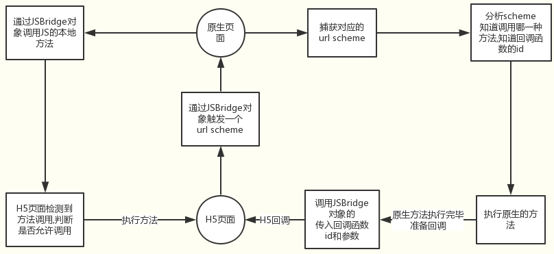

## 跨端
JSbridge原理, js和native是如何通信的?   
- 原理：
1、url scheme是一种类似于url的链接,是为了方便app直接互相调用设计的
* 具体为,可以用系统的OpenURI打开一个类似于url的链接(可拼入参数),然后系统会进行判断,如果是系统的url   scheme,则打开系统应用,否则找看是否有app注册这种scheme,打开对应app     
* 需要注意的是,这种scheme必须原生app注册后才会生效,如微信的scheme为(weixin://)  
2、而本文JSBridge中的url scheme则是仿照上述的形式的一种方式   
* 具体为,app不会注册对应的scheme,而是由前端页面通过某种方式触发scheme(如用iframe.src),然后Native用某种方法捕获对应的url触发事件,然后拿到当前的触发url,根据定义好的协议,分析当前触发了那种方法,然后根据定义来执行等   
- 如何通信：  
JSBridge是Native代码与JS代码的通信桥梁。目前的一种统一方案是:H5触发url scheme->Native捕获url scheme->原生分析,执行->原生调用h5。如下图

详解：https://blog.csdn.net/aaa333qwe/article/details/80047591